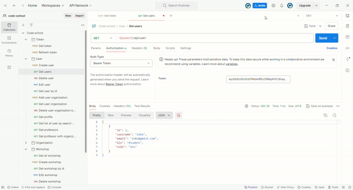

# Django Code School



Basic Django REST API project created for [Code school app](https://github.com/Roko03/code-school). Includes:
- Authentication route providing [JWT token](https://jwt.io/)
- Routes for managing users, organizations and workshops

## Summary
For this project, I follow up documentation for creating routes for my [Django REST API](https://www.django-rest-framework.org/tutorial/quickstart/).

Set up the main settings file where I add JWT token authorization and Django REST framework. 

```bash
from datetime import timedelta

REST_FRAMEWORK = {
    "DEFAULT_AUTHENTICATION_CLASSES": (
        "rest_framework_simplejwt.authentication.JWTAuthentication",
    ),
    "DEFAULT_PERMISSION_CLASSES": [
        "rest_framework.permissions.IsAuthenticated",
    ],
}

SIMPLE_JWT = {
    "ACCESS_TOKEN_LIFETIME": timedelta(minutes=30),
    "REFRESH_TOKEN_LIFETIME": timedelta(days=1),
}

INSTALLED_APPS = [
    ...
    'your_api_folder(I use api)',
    'rest_framework',
    'corsheaders',
]
```

**Enable CORS**

```bash
CORS_ALLOW_ALL_ORIGINS = True
CORS_ALLOWS_CREDENTIALS = True
```
**Serializers**

I define serializers that will help me to get data based on those serializers. The serializer is a class that is used to convert complex data types. For my project, I use [ModelSerializer](https://www.geeksforgeeks.org/modelserializer-in-serializers-django-rest-framework/) which provides a shortcut that automatically creates a Serializer class based on that Model. Also, there is a [HyperlinkedModelSerializer](https://www.geeksforgeeks.org/hyperlinkedmodelserializer-in-serializers-django-rest-framework/).

```bash
class ProfileSerializer(serializers.ModelSerializer):
    class Meta:
        model = User
        fields = ["id", "username", "email","password", "bio", "role"]
        extra_kwargs = {"password": {"write_only": True, "required": False}}
```
**Views**

Set views that takes HTTP request and return HTTP response. Views is class that has values:
- **queryset:** Get data
- **serializer_class:** Data type based on that serializer
- **permission_classes:** Permissions for user
 - **functions:** Function for get object based on some value like get_queryset or perform_create

**Generics**

Set of pre-defined views by Django REST framework that allow you to quickly create views for common use cases such as listing, creating, updating and deleting. For this example I use [ListCreateAPIView](https://www.django-rest-framework.org/api-guide/generic-views/#listcreateapiview) that usage is to list or create object. 

```bash
class ProfileUserView(generics.ListCreateAPIView):
    serializer_class = ProfileSerializer
    permission_classes = [IsAuthenticated]

    def get_queryset(self):
        user = self.request.user

        return User.objects.filter(id=user.id)
```

**URLs**

Wire up the API URLs. 

```bash
urlpatterns = [
    path("profile/", views.ProfileUserView.as_view()),
    ...
]
```

**Testing**

For testing routes, I use [Postman](https://www.postman.com/).

**Challenges and Solutions**

The most challenging part of the project was developing serializers and views based on my models. I'm proud of my work on enhancing the User model by integrating roles and extending it using Django's AbstractUser. 

## Project Structure
- **Folders and Files:** The project follows modular structure for folder with project roots and applications
- **Technologies Used:** Python, Django, Django REST framework
- **CRUD operations:** Four basic operations(Create, Read, Update, Delete)
- **JWT authorization:** The project features an authorization system using access and refresh tokens. The access token allows entry to pages, and the refresh token is used to obtain a new access token when needed, ensuring secure authentication.
- **Considerations:** The main focus of this project was develop  a practical understanding of creating APIs and implementing JWT tokens for authentication.

## Time Spent

I need 60-70 hours of work to make this project.
## How to Use

Make sure you have the following installed on your computer:

- [git](https://git-scm.com/)
- [node.js](https://nodejs.org/en)
- [npm](https://www.npmjs.com/)

Clone the repository

```bash
git clone https://github.com/Roko03/django-code-school.git
```
Set up virtual enviroment and install package

```bash
python -m venv env
env\Scripts\activate
pip install -r requirements.txt
```

Changing models and create database schema

```bash
pyhton manage.py makemigrations
python manage.py migrate
```

Create superuser

```bash
python3 manage.py createsuperuser
```

Running the Project

```bash
python manage.py runserver
```

Open [http://127.0.0.1:8000](http://127.0.0.1:8000/) to view the project

## Recommended links
- [Django REST framework](https://www.django-rest-framework.org/)
- [Django documentation](https://www.djangoproject.com/)
- [Set up Django project with virtual enviroment](https://www.youtube.com/watch?v=HBE4K1Xu9us&t=322s)
